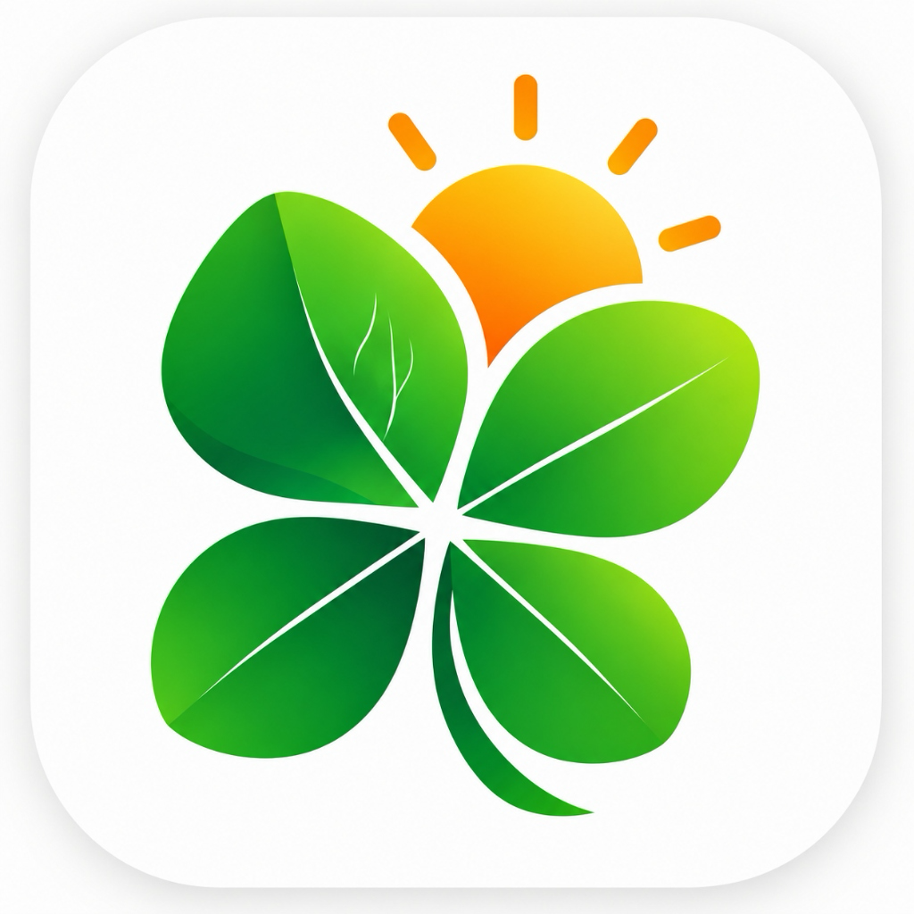

<p align="center">
  
</p>

<h1 align="center">KisanEdge (किसान एज)</h1>

<p align="center">
  <strong>Next-Generation AI-Powered Smart Farming, Crop Disease Diagnosis & Micro-Climate Telemetry Platform</strong>
</p>

<p align="center">
  <a href="https://kisanedge.netlify.app/" target="_blank">
    
  </a>
  <a href="#license">
    
  </a>
  <a href="https://nextjs.org/">
    
  </a>
  <a href="https://groq.com/">
    
  </a>
  <a href="https://www.typescriptlang.org/">
    
  </a>
  <a href="https://tailwindcss.com/">
    
  </a>
</p>

---

## 🌐 Live Application

🚀 **Experience KisanEdge live in your browser or install it as a PWA:**  
👉 **[https://kisanedge.netlify.app/](https://kisanedge.netlify.app/)**

---

## 📖 Table of Contents

- [Overview & Mission](#-overview--mission)
- [Key Features](#-key-features)
- [System Architecture (Dual Groq AI)](#-system-architecture-dual-groq-ai)
- [Vision Disease Detection Pipeline](#-vision-disease-detection-pipeline)
- [Tech Stack](#-tech-stack)
- [Project Structure](#-project-structure)
- [Getting Started](#-getting-started)
- [Environment Variables](#-environment-variables)
- [API Reference](#-api-reference)
- [Supported Languages (i18n)](#-supported-languages-i18n)
- [PWA & Offline Capability](#-pwa--offline-capability)
- [License](#-license)
- [Authors & Acknowledgments](#-authors--acknowledgments)

---

## 🌾 Overview & Mission

Smallholder farmers frequently encounter severe harvest losses due to delayed crop disease diagnosis, pest outbreaks, unpredictably shifting micro-climates, and inefficient water management.

**KisanEdge** is an intelligent, edge-ready agro-technological suite engineered to provide actionable, instant, and localized agricultural intelligence directly to farmers' fingertips. Built as an installable Progressive Web App (PWA) with multimodal vision AI, real-time IoT field sensor simulation, micro-climate weather telemetry, and multi-factor agronomic risk modeling, KisanEdge empowers growers to:

1. **Detect crop diseases instantly** from smartphone camera captures with physical visual symptom breakdowns.
2. **Prevent harvest destruction** through early-warning risk assessments and smart irrigation scheduling.
3. **Overcome language barriers** across rural communities through seamless multilingual interfaces supporting 10 Indian languages.

---

## ⚡ Key Features

### 🌿 1. Multimodal Real-Time Plant Disease Scanner
- **Powered by Groq Vision (`qwen/qwen3.8-27b`)**: Delivers ultra-low latency vision inference on captured or uploaded plant imagery.
- **Physical Symptom Extraction**: Observes and reports visible abnormalities (spots, lesions, necrosis, discoloration, edge curling, fungal patterns) before inferring any condition.
- **Strict Non-Plant Validation**: Reliably rejects human faces, animals, buildings, or indoor photos with helpful scanning instructions.
- **Conservative Confidence Scoring**: Generates an honest 0–100 AI Confidence rating (never false certainty) accompanied by disease severity ratings (`Healthy`, `Early`, `Mild`, `Moderate`, `Severe`, `Critical`).
- **Differential Diagnoses**: Suggests alternative potential causes and field conditions.
- **Integrated Treatment Plan**: Recommends organic remedies, agronomic best practices, chemical options with safety withholding periods, and preventive measures.

### 🤖 2. Multilingual KisanEdge AI Copilot
- **Powered by Groq (`openai/gpt-oss-120b`)**: A specialized, context-aware agricultural assistant.
- **Context-Aware Dialogue**: Ingests real-time farm profile data, soil telemetry, recent weather patterns, and scan history.
- **Seamless Diagnosis Handoff**: Tapping **"Ask KisanEdge AI"** on any diagnosis result immediately carries the entire clinical diagnosis into the chat session for follow-up guidance.

### 📡 3. IoT Field Sensor Hub & Telemetry Simulation
- **Real-Time Monitoring**: Tracks 4 critical field metrics:
  - **Soil Moisture** (%) with dynamic irrigation alerts.
  - **Soil Temperature** (°C) for root-zone vitality.
  - **Air Temperature** (°C) for crop stress thresholds.
  - **Ambient Humidity** (%) for foliar disease risk modeling.
- **Hardware Simulation**: Models an IoT field node with battery status, Wi-Fi connectivity, sync timestamps, and interactive connection toggles.

### 💧 4. Smart AI Irrigation Engine
- Evaluates soil moisture depletion against upcoming rainfall forecasts and evapotranspiration rates.
- Recommends instant pump triggers (*"Irrigate Now"*) or scheduling reminders to optimize water conservation.

### 📊 5. Multi-Factor Agronomic Risk Engine
Calculates localized risk indexes using live micro-climate telemetry:
- **Disease & Fungal Risk**: Tracks temperature-humidity index conducive to fungal germination.
- **Water Stress Index**: Monitors soil moisture depletion trends.
- **Heat Stress Index**: Warns when ambient temperatures surpass crop threshold tolerances.
- **Flood / Waterlogging Risk**: Analyzes cumulative rainfall against soil saturation capacity.

### 🌦️ 6. Micro-Climate Weather & Spray Window Advisory
- 7-day temperature and precipitation projections.
- Practical spray window indicators informing farmers whether winds, rain, or heat could nullify foliar spray treatments.

### 🚜 7. Multi-Plot Farm & Crop Lifecycle Manager
- Tracks individual plots, crop types (Tomato, Wheat, Potato, Rice, Corn, Cotton, Chili, Onion), planting dates, growth stages, and historical health records.

### 🌐 8. Native Multi-Language Support
- Zero-latency client-side internationalization across 10 major Indian languages.

---

## 🏛️ System Architecture (Dual Groq AI)

KisanEdge implements a clean separation of concerns with two completely independent Groq AI integrations, using dedicated API keys, specialized models, and isolated endpoints:

```
                                      +---------------------------------------------+
                                      |              KisanEdge Client               |
                                      |           (Next.js 16 + PWA App)            |
                                      +---------------------+-----------------------+
                                                            |
                             +------------------------------+------------------------------+
                             |                                                             |
                 POST /api/ai/disease-detection                                   POST /api/ai/chat
                             |                                                             |
            +--------------------------------+                            +--------------------------------+
            |      Disease Detection API     |                            |        AI Assistant API        |
            +--------------------------------+                            +--------------------------------+
            | Key: GROQ_DISEASE_API_KEY      |                            | Key: GROQ_API_KEY              |
            | Model: qwen/qwen3.8-27b        |                            | Model: openai/gpt-oss-120b     |
            | Payload: Multimodal Image (B64)|                            | Payload: Chat History + Telemetry|
            | Output: Strictly Validated JSON|                            | Output: Streaming Markdown     |
            +--------------------------------+                            +--------------------------------+
```

| Dimension | 1. KisanEdge Disease Scanner | 2. KisanEdge AI Assistant |
| :--- | :--- | :--- |
| **Endpoint** | `POST /api/ai/disease-detection` | `POST /api/ai/chat` |
| **Model** | `qwen/qwen3.8-27b` | `openai/gpt-oss-120b` |
| **Input Modality** | Image (Base64 / Data URL) + Crop context | Multi-turn text + Agronomic farm telemetry |
| **Role & Persona** | Objective plant pathologist & visual observer | Conversational farmer copilot & agronomy guide |
| **Token Budget** | Calibrated to 450 tokens (Groq 1,000 OTPM safe) | Standard conversational streaming |
| **Output Type** | Strongly-typed, validated JSON schema | Rich conversational Markdown with suggestions |
| **Security** | Server-side key isolation (`GROQ_DISEASE_API_KEY`) | Server-side key isolation (`GROQ_API_KEY`) |

---

## 🔬 Vision Disease Detection Pipeline

```
[ Camera / Upload ]
        |
        v
[ Client-Side Resizing (Max 1024px @ 0.85 Quality) ]  --> Keeps input tokens ~800 (Prevents TPM exhaustion)
        |
        v
[ Pre-Flight Validation ]                            --> MIME check (JPEG/PNG/WEBP) & Size guard (≤ 20 MB)
        |
        v
[ Groq Vision Inference (qwen/qwen3.8-27b) ]          --> Strict visual evidence extraction (max_tokens: 450)
        |
        +---> Non-Plant / Face / Room Detected? ======> Returns status: "not_a_plant", plantDetected: false
        |
        +---> Plant Detected? ========================> Extracts: Symptoms, Severity, Confidence, Treatments
        |
        v
[ Backend Schema Sanitizer ]                         --> Normalizes nullables, enforces fallback safety
        |
        v
[ Rich Visual Diagnosis UI (/results) ]              --> Severity bar, Vitality Score, Timeline, Next Steps
```

---

## 🛠️ Tech Stack

| Category | Technology | Description |
| :--- | :--- | :--- |
| **Framework** | [Next.js 16 (App Router)](https://nextjs.org/) | Server-side rendering, API routes, optimized caching |
| **Runtime & UI** | [React 19](https://react.dev/) | Modern concurrent UI architecture |
| **Language** | [TypeScript 5](https://www.typescriptlang.org/) | End-to-end type safety across client and API routes |
| **Styling** | [Tailwind CSS v4](https://tailwindcss.com/) | Modern CSS-first utility styling & design tokens |
| **Animations** | [Framer Motion](https://www.framer.com/motion/) | Gesture-driven transitions & micro-animations |
| **Icons** | [Lucide React](https://lucide.dev/) & [React Icons](https://react-icons.github.io/react-icons/) | Crisp, lightweight SVG iconography |
| **Vision AI** | [Groq SDK](https://groq.com/) • `qwen/qwen3.8-27b` | High-throughput multimodal visual plant diagnosis |
| **Copilot AI** | [Groq SDK](https://groq.com/) • `openai/gpt-oss-120b` | Conversational intelligence and advisory reasoning |
| **PWA** | [@ducanh2912/next-pwa](https://github.com/DuCanhGH/next-pwa) | Service workers, asset precaching, install prompts |
| **Markdown** | `react-markdown` + `remark-gfm` | Formatted rendering of agronomic recommendations |
| **Deployment** | [Netlify](https://www.netlify.com/) | Edge-deployed static and serverless hosting |

---

## 📁 Project Structure

```
kisanedge/
├── public/                     # Static assets, PWA icons, manifest, and illustrations
│   ├── crops/                  # Crop iconography (tomato, wheat, potato, etc.)
│   ├── logo-squircle-hd.png    # Primary brand identity logo
│   └── manifest.json           # Web App Manifest for PWA installation
├── src/
│   ├── app/                    # Next.js App Router
│   │   ├── (app)/              # Authenticated / Application shell routes
│   │   │   ├── alerts/         # Agricultural warnings & pest outbreak notices
│   │   │   ├── assistant/      # Fullscreen KisanEdge AI Copilot chat interface
│   │   │   ├── community/      # Farmer peer community & advisory forum
│   │   │   ├── environment/    # IoT Sensor hub, telemetry & risk engine
│   │   │   ├── farm/           # Crop plot manager & growth stage trackers
│   │   │   ├── history/        # Historical scan archive & past diagnoses
│   │   │   ├── home/           # Main dashboard overview
│   │   │   ├── profile/        # Farmer settings, land details, language picker
│   │   │   ├── results/        # Comprehensive disease diagnosis assessment view
│   │   │   ├── scan/           # Camera viewfinder & photo upload diagnosis tool
│   │   │   ├── tools/          # Seed, fertilizer, and irrigation calculators
│   │   │   └── weather/        # 7-day microclimate weather & spray forecasts
│   │   ├── api/ai/             # Groq AI backend endpoints
│   │   │   ├── chat/           # Conversational assistant endpoint (gpt-oss-120b)
│   │   │   └── disease-detection/ # Multimodal plant vision endpoint (qwen3.8-27b)
│   │   ├── onboarding/         # First-time user language and crop onboarding flow
│   │   └── layout.tsx          # Root HTML layout, font setup, and providers
│   ├── components/             # Reusable UI & feature components
│   │   ├── features/           # Domain components (weather cards, sensor widgets)
│   │   ├── layout/             # Header, Navigation bar, and App shell
│   │   └── ui/                 # Buttons, modals, gauges, and badges
│   ├── lib/                    # Core utilities, AI orchestration & helpers
│   │   ├── ai/                 # Groq client instances, prompts, and validators
│   │   ├── i18n/               # Multilingual translations and language context
│   │   ├── demo-state.tsx      # Client-side demo state & telemetry simulation
│   │   ├── mock-data.ts        # Telemetry seeds, fallback data, and mock sensors
│   │   └── storage.ts          # Safe LocalStorage wrapper for offline caching
│   └── types/                  # TypeScript interface definitions (disease, weather, etc.)
├── next.config.ts              # Next.js configuration with PWA integration
├── package.json                # Project dependencies and npm scripts
├── tsconfig.json               # TypeScript configuration
└── LICENSE                     # MIT License
```

---

## 🚀 Getting Started

### Prerequisites
- **Node.js**: `v20.x` or higher
- **npm**, **pnpm**, or **yarn**
- **Groq API Account**: Free API keys from [console.groq.com](https://console.groq.com)

### 1. Clone the Repository
```bash
git clone https://github.com/MdKasif0/KisanEdge.git
cd KisanEdge
```

### 2. Install Dependencies
```bash
npm install
```

### 3. Configure Environment Variables
Create a `.env.local` file in the project root:
```bash
cp .env.example .env.local
```

Populate `.env.local` with your Groq API credentials:
```env
# Groq API Key for the General AI Assistant (openai/gpt-oss-120b)
GROQ_API_KEY=gsk_your_groq_api_key_here

# Separate Groq API Key for Vision Disease Detection (qwen/qwen3.8-27b)
GROQ_DISEASE_API_KEY=gsk_your_groq_disease_api_key_here
```

> **Note**: You may use the same Groq API key for both fields during local development, or use separate keys to track usage and isolate rate limit tiers.

### 4. Run the Development Server
```bash
npm run dev
```

Open [http://localhost:3000](http://localhost:3000) (or the assigned port shown in your terminal) to view KisanEdge.

### 5. Build for Production
```bash
npm run build
npm run start
```

---

## 🔑 Environment Variables

| Variable | Required | Description |
| :--- | :---: | :--- |
| `GROQ_API_KEY` | **Yes** | Server-side key used for KisanEdge AI Copilot (`openai/gpt-oss-120b`). |
| `GROQ_DISEASE_API_KEY` | **Yes** | Dedicated server-side key for multimodal disease vision analysis (`qwen/qwen3.8-27b`). |

*Neither key is ever prefixed with `NEXT_PUBLIC_`, ensuring zero credential exposure to client-side bundles.*

---

## 📡 API Reference

### 1. Plant Disease Detection
- **Endpoint**: `POST /api/ai/disease-detection`
- **Content-Type**: `multipart/form-data` or `application/json` (Base64 payload)
- **Request Body**:
  ```json
  {
    "image": "data:image/jpeg;base64,...",
    "cropContext": {
      "crop": "Tomato",
      "temperature": 28,
      "humidity": 75
    }
  }
  ```
- **Response Format (`200 OK`)**:
  ```json
  {
    "status": "disease_detected",
    "plantDetected": true,
    "plantType": "Tomato",
    "affectedPart": "leaf",
    "conditionName": "Early Blight",
    "pathogenType": "fungal",
    "confidenceScore": 88,
    "severity": "early",
    "observedSymptoms": [
      "Dark brown circular spots on lower leaves",
      "Concentric ring patterns forming target spots",
      "Chlorotic yellow halos surrounding necrotic lesions"
    ],
    "visualAnalysis": "The image reveals classic Alternaria solani concentric ring lesions localized on mature leaves without extensive defoliation.",
    "alternativePossibilities": [
      { "condition": "Septoria Leaf Spot", "likelihood": "low", "reason": "Septoria spots are typically smaller with black pycnidia centers." }
    ],
    "treatmentRecommendations": {
      "immediateActions": ["Prune and dispose of infected lower leaves away from the plot."],
      "organicTreatments": ["Apply copper-based fungicide or neem oil spray."],
      "chemicalOptions": ["Chlorothalonil or Mancozeb spray if conditions persist."],
      "preventiveMeasures": ["Avoid overhead irrigation; water at base to keep leaves dry."]
    },
    "environmentalRisk": "moderate"
  }
  ```

---

## 🌐 Supported Languages (i18n)

KisanEdge is fully localized across 10 major Indian languages:

| Code | Language | Native Script | Code | Language | Native Script |
| :---: | :--- | :--- | :---: | :--- | :--- |
| `en` | English | English | `ta` | Tamil | தமிழ் |
| `hi` | Hindi | हिन्दी | `kn` | Kannada | ಕನ್ನಡ |
| `bn` | Bengali | বাংলা | `ml` | Malayalam | മലയാളം |
| `mr` | Marathi | मराठी | `gu` | Gujarati | ગુજરાતી |
| `te` | Telugu | తెలుగు | `pa` | Punjabi | ਪੰਜਾਬੀ |

Users can switch languages anytime from the **Onboarding** flow or the **Profile & Settings** page.

---

## 📱 PWA & Offline Capability

KisanEdge is configured as an installable Progressive Web App:
- **Add to Home Screen**: Installable on Android (Chrome), iOS (Safari), and Desktop.
- **Service Worker Precaching**: Caches core application shells, fonts, and stylesheets for immediate loading even in remote rural connectivity conditions.
- **Offline Scan Queue**: Retains offline detection indicators and locally caches recent scan reports in `localStorage`.

---

## 📄 License

This project is licensed under the **MIT License** - see the [LICENSE](LICENSE) file for full details.

```
MIT License
Copyright (c) 2026 Md Kasifuddin and KisanEdge Contributors
```

---

## 👨‍💻 Authors & Acknowledgments

- **Developed by**: [Md Kasifuddin](https://github.com/MdKasif0)
- **AI Infrastructure**: [Groq Cloud](https://groq.com/) for lightning-fast LPU inference (`qwen/qwen3.8-27b` & `openai/gpt-oss-120b`).
- **Framework**: Built with [Next.js](https://nextjs.org/) by Vercel.

---

<p align="center">
  <sub>Made with ❤️ for farmers, growers, and agricultural communities worldwide.</sub>
</p>
